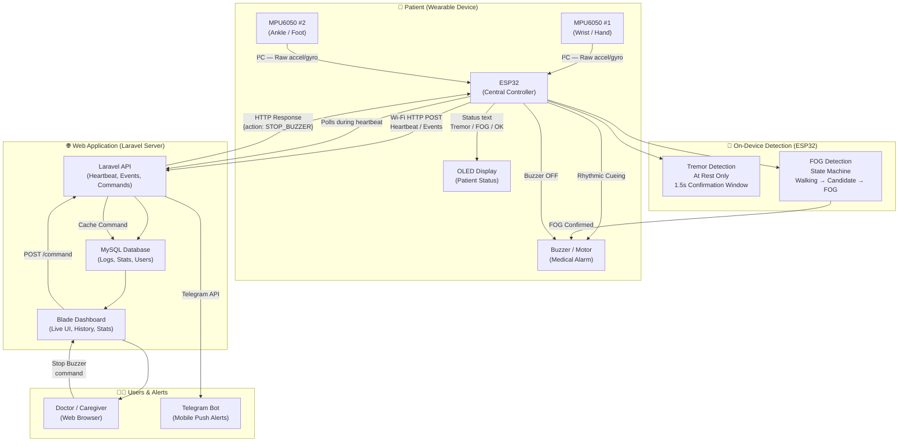

# System Architecture

## Overview

This document defines the architecture for the ESP32-Based Parkinson's Monitoring System as of **Phase 14 (Completed)**. 

---

## Architecture Principles

| Principle | Decision |
|---|---|
| **Detection location** | All sensor-based decisions (tremor, FOG) are made **locally on the ESP32**. The server never performs detection. |
| **Detection method** | Rule-based, threshold-based algorithms with moving averages and hysteresis. |
| **Communication** | ESP32 transmits **confirmed events** and heartbeat status to Laravel over Wi-Fi (HTTP/JSON). |
| **Cueing** | Rhythmic buzzer/vibration motor controlled exclusively by the ESP32 upon FOG detection. |
| **Command channel** | Doctor/caregiver sends Stop Cueing via Laravel Dashboard; ESP32 polls for commands during heartbeats. |
| **Alerts** | Telegram Push Notifications sent from Laravel via `TelegramService` to Caregivers. |
| **Database** | MySQL (via XAMPP/MariaDB). Stores Patients, Devices, and Detection Events. |
| **Frontend** | Laravel Blade templates using modern Glassmorphism UI, JS polling every 1 second. |

---

## Full System Architecture Diagram

---

## Component Responsibilities

### ESP32 — Responsibilities
- Read raw sensor data from both MPU6050 sensors via I²C.
- Run tremor detection algorithm (wrist sensor) and FOG state machine (ankle sensor).
- Drive OLED display with current status.
- Drive buzzer using a rhythmic medical pattern (150ms ON, 100ms OFF, etc).
- Transmit confirmed events and live status to Laravel API.
- Receive and process remote commands (Stop Buzzer).

### Laravel — Responsibilities
- Expose HTTP API endpoints for event ingestion (`/api/events`) and heartbeats (`/api/heartbeat`).
- Push detailed Telegram notifications to caregivers.
- Store event data in MySQL to calculate daily and lifetime statistics.
- Provide Blade-rendered dashboard with 1-second real-time polling.
- Implement session-based authentication for Doctors/Caregivers.
- Store and serve remote Stop Buzzer commands via Laravel Cache.

### MySQL — Responsibilities
- Store application data: `users`, `patients`, `devices`, `detection_events`.
- Provide indexed queries for dashboard history (filtering, sorting, pagination).
