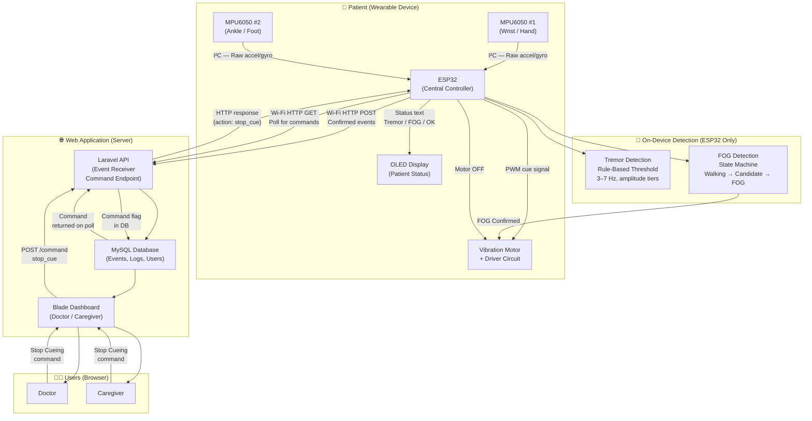
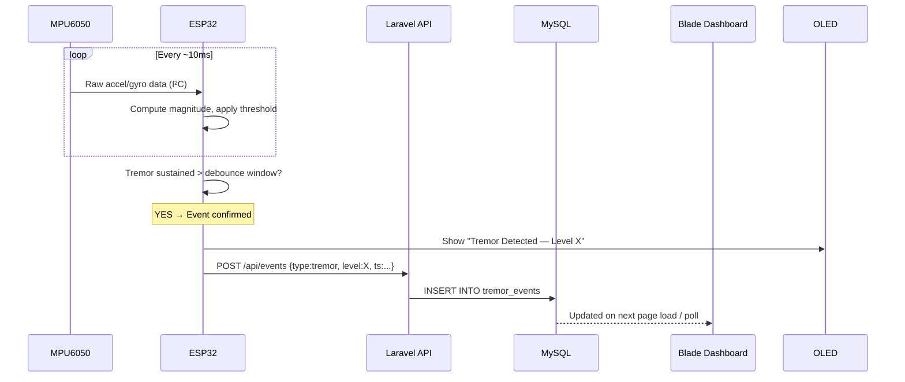
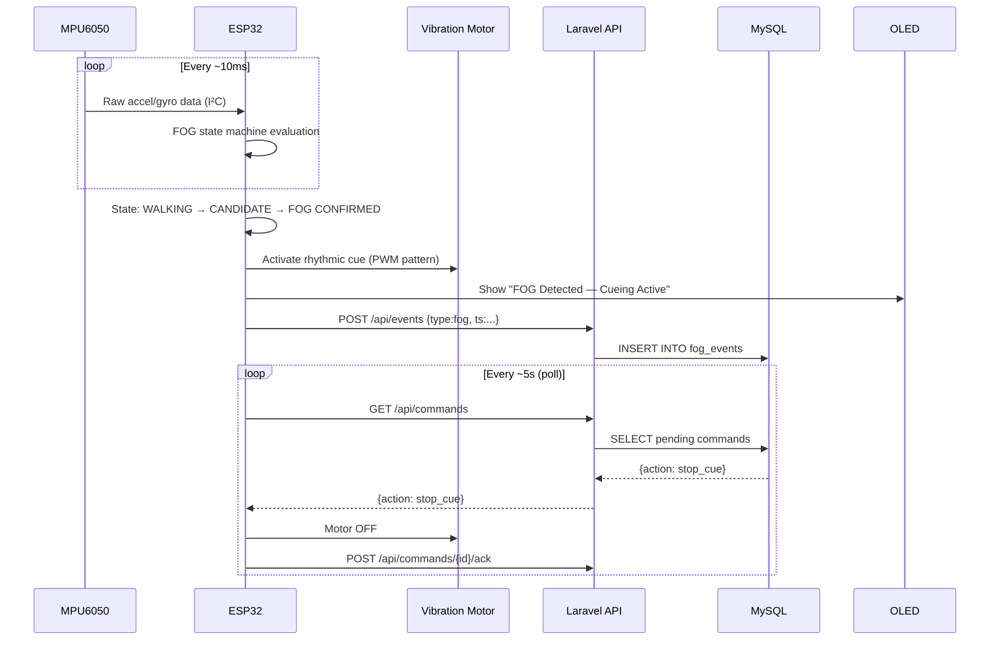

# System Architecture

## Overview

This document defines the confirmed architecture for the ESP32-Based Parkinson's Monitoring System. All design decisions recorded here are authoritative for subsequent development phases.

---

## Architecture Principles

| Principle | Decision |
|---|---|
| **Detection location** | All sensor-based decisions (tremor, FOG) are made **locally on the ESP32**. The server never performs detection. |
| **Detection method** | Rule-based, threshold-based algorithms only. No machine learning. No dataset-based prediction. |
| **Communication** | ESP32 transmits **confirmed events** to Laravel over Wi-Fi (HTTP/JSON). |
| **Cueing** | Vibration motor controlled exclusively by the ESP32. |
| **Command channel** | Doctor/caregiver sends Stop Cueing via Laravel; ESP32 polls for commands. |
| **Database** | MySQL (via XAMPP/MariaDB in development). No substitutes (no SQLite, no PostgreSQL). |
| **Frontend** | Laravel Blade templates. Basic JavaScript only when required. |

---

## Full System Architecture Diagram

---

## Data Flow: Tremor Event

---

## Data Flow: FOG Event and Cueing

---

## Component Responsibilities

### ESP32 — Responsibilities
- Read raw sensor data from both MPU6050 sensors via I²C.
- Run tremor detection algorithm (wrist sensor).
- Run FOG detection state machine (ankle sensor).
- Drive OLED display with current status.
- Drive vibration motor via driver circuit (PWM).
- Synchronize time via NTP over Wi-Fi.
- Transmit confirmed events to Laravel API.
- Poll Laravel API for remote commands (Stop Cueing).
- Acknowledge received commands.

### Laravel — Responsibilities
- Expose HTTP API endpoints for event ingestion and command polling.
- Authenticate requests from the ESP32 (API token).
- Store event data in MySQL with accurate timestamps.
- Provide Blade-rendered dashboard for Doctor/Caregiver.
- Implement role-based access control (Doctor vs Caregiver).
- Store and serve remote Stop Cueing commands.
- Log command acknowledgements.

### Laravel — Explicit Non-Responsibilities
> ❌ Laravel does **NOT** perform tremor detection.  
> ❌ Laravel does **NOT** perform FOG detection.  
> ❌ Laravel does **NOT** analyze raw sensor data.  
> ❌ Laravel does **NOT** control the vibration motor directly.

### MySQL — Responsibilities
- Store all application data: users, roles, devices, events, commands, logs.
- Provide indexed queries for dashboard display and filtering.
- Maintain referential integrity between entities.

---

## Hardware Interface Summary

| Interface | Devices | Protocol |
|---|---|---|
| MPU6050 #1 ↔ ESP32 | Wrist sensor | I²C (address 0x68) |
| MPU6050 #2 ↔ ESP32 | Ankle sensor | I²C (address 0x69, AD0=HIGH) |
| OLED ↔ ESP32 | SSD1306 128×64 | I²C |
| Vibration Motor ↔ ESP32 | Via MOSFET/BJT driver | GPIO PWM |
| ESP32 ↔ Internet | Wi-Fi router | IEEE 802.11 b/g/n |
| Browser ↔ Laravel | Doctor/Caregiver | HTTP/HTTPS |

---

## Security Considerations (To Be Implemented in Later Phases)

- ESP32 authenticates to Laravel API using a pre-shared API token stored in firmware.
- Doctor/Caregiver authenticate via Laravel's session-based authentication (Breeze or custom).
- `.env` and all secrets are excluded from version control via `.gitignore`.
- Environment-specific credentials are never hardcoded in source files.

---

## Development Environment Stack

| Tool | Version | Role |
|---|---|---|
| PHP | 8.2.12 (XAMPP) | Laravel runtime |
| Composer | 2.9.8 | PHP dependency manager |
| MySQL/MariaDB | 10.4.32 (XAMPP) | Database server |
| Node.js | 24.14.1 | Frontend asset tooling |
| npm | 11.11.0 | Node package manager |
| Git | 2.51.0 | Version control |
| PlatformIO | Not yet installed | ESP32 firmware build |
